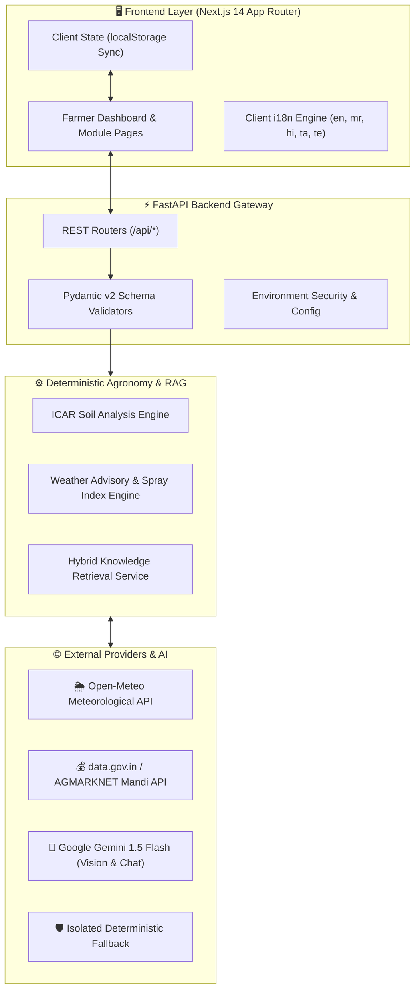

# 🌾 KisanMitra

## Smarter Decisions. Healthier Farms.

**KisanMitra** is an AI-powered agricultural decision-support platform designed for Indian farmers. It unifies multimodal crop disease diagnostics, deterministic soil health evaluations, hyperlocal weather intelligence, real-time APMC mandi price discovery, and curated government schemes into one intuitive, accessible, and multilingual platform.

[](https://hackday.dev)
[](https://hackday.dev)
[](https://nextjs.org)
[](https://fastapi.tiangolo.com)
[](https://www.typescriptlang.org)
[](https://tailwindcss.com)

---

## 🚜 Problem

Indian farmers routinely make high-stakes agricultural decisions with fragmented, opaque data:
* **Visual Disease Misdiagnosis:** Misidentifying leaf symptoms leads to purchasing ineffective chemical treatments, causing crop loss and financial distress.
* **Complex Soil Reports:** Raw laboratory values for pH, N, P, and K are rarely translated into actionable, balanced fertilizer schedules.
* **Disconnected Weather Forecasts:** Standard weather apps display raw metrics without farm-specific guidance (e.g. pesticide spray window suitability, frost risk).
* **Mandi Price Opacity:** Smallholder farmers lack real-time price discovery across nearby APMC markets, leading to unfair pricing from middlemen.
* **Unclaimed Government Schemes:** Information regarding crop insurance (PMFBY), income support (PM-KISAN), and irrigation subsidies remains scattered.
* **Language Barriers:** Most digital farm tools alienate non-English speakers.

---

## 💡 Solution

KisanMitra connects these fragmented pieces into a single, cohesive decision chain:

$$\text{FARMER DECISION} \longrightarrow \text{RELEVANT DATA} \longrightarrow \text{INTELLIGENCE} \longrightarrow \text{ACTIONABLE GUIDANCE}$$

Instead of treating AI as a novelty chatbot, KisanMitra uses AI to synthesize real-time farm data and provide grounded, safe agronomic advice.

---

## ✨ Features

### 🌿 AI Crop Doctor
* Multi-modal computer vision analysis powered by **Gemini 1.5 Flash Vision**.
* Detects crop conditions from leaf images with probabilistic severity ratings (*Healthy, Mild, Moderate, Severe*).
* Delivers visual observations, plain-language explanations, and safe cultural/organic management steps without hazardous chemical prescriptions.

### 🧪 Soil Health Intelligence
* Deterministic agronomic evaluation engine grounded in standard **ICAR soil testing benchmarks**.
* Calculates an overall Soil Health Score (0–100) and classifies pH, Nitrogen (N), Phosphorus (P), Potassium (K), and Organic Carbon.
* Formulates customized split-dose fertilization plans, organic manure recommendations, and soil amendment advisories.

### 🌦 Weather Intelligence & Farm Alerts
* Consumes real-time meteorological forecasts from **Open-Meteo**.
* Calculates a **Foliar Spray Suitability Index** (evaluating wind speed, rain probability, and humidity).
* Delivers proactive agricultural risk warnings (heat stress, frost, crop lodging winds, fungal disease incubation) and a 7-day farm timeline.

### 💰 Mandi Price Intelligence
* Direct integration with Government of India **data.gov.in / AGMARKNET** wholesale market records.
* Discovers real-time modal, minimum, and maximum prices (₹/quintal) with multi-market comparison tables.
* Guaranteed data trust: 100% transparent live vs. demo status indicators with zero fabricated prices.

### 🏛️ Government Schemes
* Curated repository of Central and State agricultural schemes (PMFBY, PM-KISAN, Kisan Credit Card, micro-irrigation subsidies).
* Provides comprehensive eligibility criteria, required document checklists, and direct links to official application portals (`myscheme.gov.in`).

### 🌾 Location-Based Crop Guide
* Comprehensive agronomy handbook covering 8 staple and cash crops (*Soybean, Wheat, Cotton, Rice, Tomato, Onion, Maize, Sugarcane*).
* Outlines optimal soil conditions, sowing windows, seed rates, critical watering stages, and pest prevention strategies.

### 🌐 Multilingual Farmer Experience
* Complete native language experience in **5 languages**:
  * 🇬🇧 English (`en`)
  * 🇮🇳 Marathi (`mr` — मराठी)
  * 🇮🇳 Hindi (`hi` — हिन्दी)
  * 🇮🇳 Tamil (`ta` — தமிழ்)
  * 🇮🇳 Telugu (`te` — తెలుగు)
* 100% translation parity (300/300 keys) with instant client-side switching and native script rendering.

### 🤖 Context-Aware AI Farmer Assistant
* The conversational nexus that automatically ingests active farm context (selected crop, recent soil test, leaf diagnostic results, hyperlocal weather, and nearby mandi prices).
* Uses hybrid knowledge retrieval (RAG) and Gemini reasoning to deliver context-grounded agronomic advice with attributed source badges and confidence indicators.

---

## 🏗️ Architecture



---

## 🛠️ Tech Stack

| Layer | Technology | Purpose |
| :--- | :--- | :--- |
| **Frontend** | **Next.js 14**, **React 18**, **TypeScript 5.6** | App Router, responsive SSR/CSR, static page generation |
| **Styling** | **Tailwind CSS 3.4**, **clsx**, **tailwind-merge** | Custom agricultural design system tokens & accessibility |
| **Icons** | **Lucide React** | High-contrast, clean SVG iconography |
| **Backend** | **FastAPI 0.115**, **Python 3.11**, **Uvicorn** | Asynchronous REST API, auto-generated OpenAPI docs |
| **Validation** | **Pydantic v2**, **Pydantic-Settings** | Runtime data contract validation and settings isolation |
| **AI Vision & Chat** | **Google Gemini 1.5 Flash** (via REST) | Crop pathology image analysis & grounded farm reasoning |
| **Weather** | **Open-Meteo APIs** | Forecasts, precipitation, and agricultural meteorology |
| **Market Rates** | **data.gov.in / AGMARKNET** | Official APMC wholesale commodity prices |
| **Testing** | **Pytest**, **TSX** | Automated backend and i18n test suites |

---

## 📊 Data Sources

* **Weather:** [Open-Meteo Meteorological Service](https://open-meteo.com)
* **Market Prices:** [Open Government Data Platform India (data.gov.in)](https://data.gov.in) / AGMARKNET
* **Government Schemes:** [Ministry of Agriculture & Farmers Welfare / myScheme Portal](https://myscheme.gov.in)
* **Agronomy & Soil:** [Indian Council of Agricultural Research (ICAR)](https://icar.org.in)

---

## 🌐 Supported Languages

| Language | Native Name | Code | Locale | Key Parity |
| :--- | :--- | :--- | :--- | :--- |
| **English** | English | `en` | `en-IN` | 300 / 300 (100%) |
| **Marathi** | मराठी | `mr` | `mr-IN` | 300 / 300 (100%) |
| **Hindi** | हिन्दी | `hi` | `hi-IN` | 300 / 300 (100%) |
| **Tamil** | தமிழ் | `ta` | `ta-IN` | 300 / 300 (100%) |
| **Telugu** | తెలుగు | `te` | `te-IN` | 300 / 300 (100%) |

---

## 📁 Repository Structure

```text
KisanMitra/
├── frontend/                   # Next.js 14 App Router application
│   ├── app/                    # 12 App Router pages & routes
│   │   ├── assistant/          # AI Farmer Assistant
│   │   ├── crop-doctor/        # Vision Disease Diagnosis
│   │   ├── crop-guide/         # ICAR Agronomy Guide
│   │   ├── dashboard/          # Central Farmer Dashboard
│   │   ├── mandi/              # Mandi Price Discovery
│   │   ├── schemes/            # Govt Schemes & Detail Views
│   │   ├── soil/               # Soil Health Intelligence
│   │   └── weather/            # Weather Forecasts & Alerts
│   ├── components/             # Reusable UI, Layout, and Feature components
│   ├── lib/                    # API client and i18n translation catalogs
│   ├── types/                  # TypeScript interface contracts
│   └── test-i18n.ts            # Automated multilingual test suite
│
├── backend/                    # FastAPI asynchronous Python backend
│   ├── app/
│   │   ├── api/                # REST endpoint routers
│   │   ├── core/               # Pydantic settings & configuration
│   │   ├── schemas/            # Pydantic validation models
│   │   └── services/           # Business logic, engines & AI clients
│   └── tests/                  # Pytest backend test suite (68 tests)
│
├── docs/                       # Project, architecture & development documentation
│   ├── architecture/           # System overview and AI pipeline specs
│   ├── development/            # Phase 1 through 10 engineering records
│   ├── presentation/           # Hackathon pitch deck directory
│   ├── project/                # Problem, solution, tech stack & future scope
│   └── screenshots/            # UI captures & visual records
│
├── assets/                     # Visual assets, branding tokens & demo samples
│   ├── logo/                   # Brand palette and emblem guidelines
│   └── demo/                   # Test fixtures for live demonstrations
│
├── .env.example                # Environment variables template
├── .gitignore                  # Git ignore rules
└── README.md                   # Project overview & documentation
```

---

## 🚀 Local Setup

### 1. Prerequisites
* **Node.js:** v18+ (v20 recommended)
* **Python:** 3.11+
* **Package Managers:** `npm` and `pip`

### 2. Backend Setup
```bash
# Navigate to backend
cd backend

# Install Python dependencies
pip install -r requirements.txt

# Start FastAPI server
python -m uvicorn app.main:app --reload --port 8000
```
Backend will be live at:
* API Root: [http://localhost:8000/api/health](http://localhost:8000/api/health)
* Interactive Swagger Docs: [http://localhost:8000/docs](http://localhost:8000/docs)

### 3. Frontend Setup
```bash
# Navigate to frontend
cd frontend

# Install Node dependencies
npm install

# Start Next.js development server
npm run dev
```
Open [http://localhost:3000](http://localhost:3000) in your browser.

---

## 🔐 Environment Variables

Copy `.env.example` to create your local `.env` file if configuring live keys:

```bash
cp .env.example .env
```

| Variable | Description | Default / Required |
| :--- | :--- | :--- |
| `NEXT_PUBLIC_API_URL` | Frontend link to FastAPI backend | `http://localhost:8000` |
| `GEMINI_API_KEY` | Google AI Studio key for Gemini 1.5 Flash | Optional (has offline demo fallback) |
| `GEMINI_MODEL` | Configured Gemini generative model | `gemini-1.5-flash` |
| `MANDI_API_KEY` | data.gov.in API key for live APMC data | Optional (has offline demo fallback) |
| `WEATHER_API_URL` | Open-Meteo forecast endpoint | `https://api.open-meteo.com/v1/forecast` |

> [!CAUTION]
> **NEVER commit `.env` or any secret keys to version control.** All secrets must remain strictly backend-side.

---

## 🧪 Testing

### 1. Run Backend Test Suite
```bash
cd backend
python -m pytest tests/
```
**Verified Result:** `68 passed in 4.16s` with zero warnings.

### 2. Run Multilingual i18n Test Suite
```bash
cd frontend
npx tsx test-i18n.ts
```
**Verified Result:** `300/300 keys passed across all 5 languages` with verified Unicode integrity.

### 3. Verify Python Code Compilation
```bash
cd backend
python -m compileall app
```
**Verified Result:** Clean compilation with zero syntax errors.

### 4. Verify Frontend Production Build
```bash
cd frontend
npm run build
```
**Verified Result:** Optimized production bundle across all 12 App Router pages with zero TypeScript errors.

---

## 🧩 Demo / Fallback Behavior

KisanMitra is built with **isolated deterministic fallback generators** to guarantee uninterrupted live demonstrations:
* **Gemini Offline Mode:** If `GEMINI_API_KEY` is not supplied or network connectivity drops, the application falls back to an offline rule-based agronomy generator with clearly labeled **Demo** indicators.
* **Mandi Offline Mode:** If `MANDI_API_KEY` is not present, realistic APMC historical records are displayed with explicit **Demo Data** provenance badges.
* **Data Trust Guarantee:** KisanMitra *never* represents demo or calculated information as live government data.

---

## ⚠️ Limitations

* **Advisory Nature:** AI recommendations are decision-support aids and do not replace certified agricultural extension officers or Krishi Vigyan Kendra (KVK) scientists.
* **Image Quality Dependency:** Crop Doctor accuracy depends on clear, focused photographs of plant leaves under adequate natural lighting.
* **Network Connectivity:** Live weather and market updates require internet connectivity (though UI retains offline state via client cache).

---

## 🚀 Future Scope

* **🎙️ Voice-First Multilingual Interaction:** Indic voice-to-voice integration (Bhashini / AI4Bharat IndicWhisper).
* **📡 IoT Telemetry:** Real-time ingestion of soil moisture, temperature, and NPK sensor readings.
* **🛰️ Satellite Remote Sensing:** Sentinel-2 NDVI vegetative health and drought index mapping.
* **🔮 Predictive Pest Outbreak Alerts:** Correlating regional meteorological spikes with historical pest cycles.
* **👨‍🔬 Direct KVK Agronomist Tele-Consultation:** 1-click expert escalation for complex crop disorders.

---

## 🏆 Hackathon Details

* **Hackathon:** **HACKDAY 1.0**
* **Theme:** **Tech for a Better Tomorrow**
* **Repository:** [https://github.com/AniketGaikwad18/KisanMitra](https://github.com/AniketGaikwad18/KisanMitra)
* **Tagline:** *"Smarter Decisions. Healthier Farms."*
