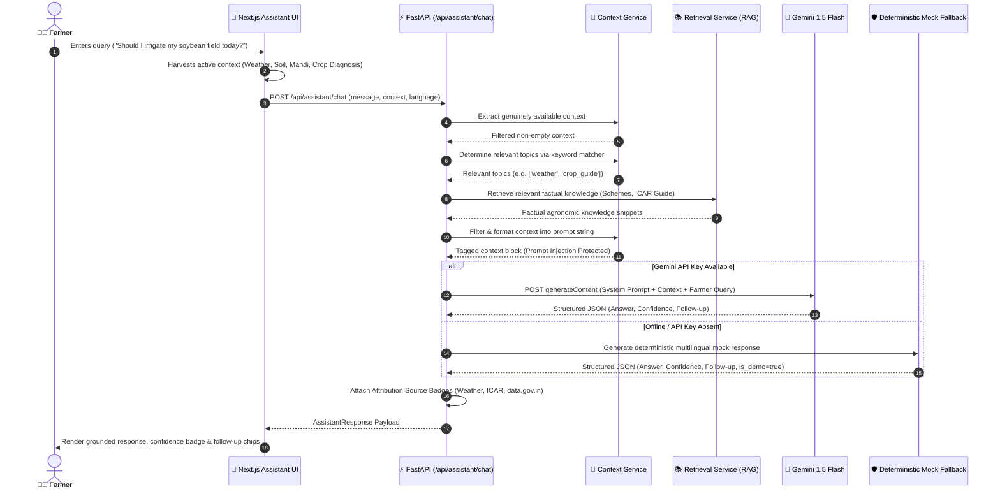

# 🤖 AI Farmer Assistant Pipeline

## Context-Aware Conversational Agronomy

The AI Farmer Assistant is the conversational nexus of KisanMitra. Unlike standard chatbots that provide generic textbook advice, the KisanMitra Assistant grounds its reasoning in real-time, multi-dimensional farm context.

---

## 🔄 End-to-End Assistant Pipeline

---

## 🛡️ Grounding & Prompt Injection Safeguards

1. **Context Isolation:** Farm parameters are enclosed within explicit reference markers (`AVAILABLE KISANMITRA FARM CONTEXT`) with explicit system instructions to treat context as reference data rather than instructions.
2. **Missing Data Transparency:** If a specific metric (e.g. soil nitrogen or leaf scan) is absent from the farmer's profile, the assistant acknowledges the data gap without inventing numbers.
3. **Safety Boundaries:**
   * Probabilistic phrasing for plant health (*"Observed symptoms suggest possible..."*).
   * Strict ban on dangerous chemical formulations or unverified pesticide mixing.
   * Prohibition of yield or future price guarantees.
   * Mandatory recommendation to consult local Krishi Vigyan Kendra (KVK) officers for critical interventions.
