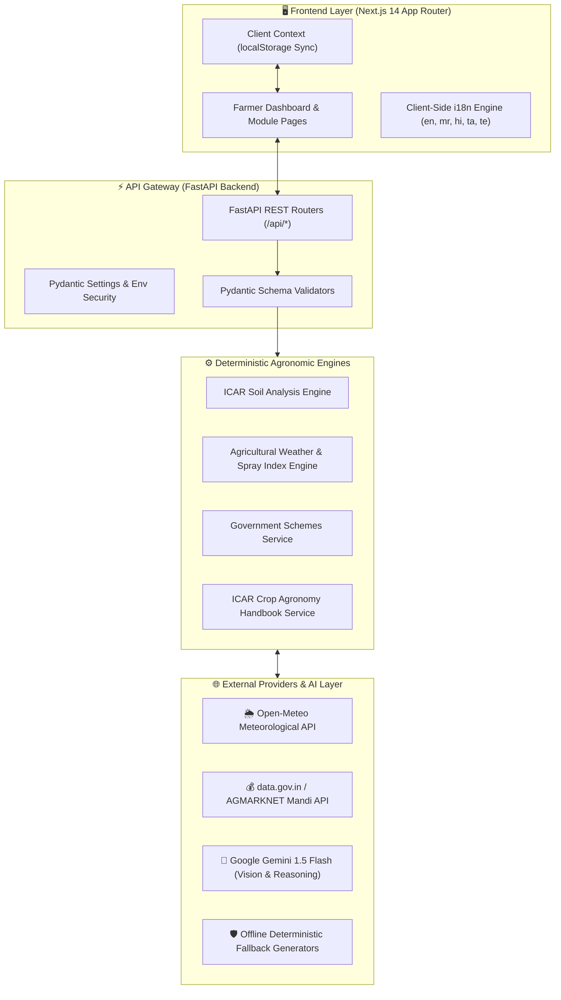

# 🏗️ System Architecture Overview

## Multi-Tier End-to-End Flow

KisanMitra is built as a modular multi-tier architecture that clearly separates user presentation, API routing, deterministic agronomic intelligence engines, external data consumption, and AI reasoning.

---

## 📐 High-Level Architecture Diagram

---

## 🏛️ Layer Responsibilities

### 1. Presentation Tier (Next.js 14)
* **Client-Side Rendering:** Interactive dashboards, responsive grid layouts, camera/file upload previews, and real-time form inputs.
* **i18n Localization:** Context provider storing selected language in `localStorage`, instantaneously translating 300+ keys across English, Marathi, Hindi, Tamil, and Telugu without page refreshes.
* **Context Persistence:** Harvests active farm state (`kisanmitra_last_crop_check`, `kisanmitra_last_soil_check`, `kisanmitra_weather_location`, `kisanmitra_mandi_filters`) to feed the AI Assistant.

### 2. Service & Gateway Tier (FastAPI)
* **Asynchronous Endpoints:** High-concurrency async handlers processing weather, soil, mandi, schemes, crop guide, and chat requests.
* **Type Safety & Validation:** Strict Pydantic models ensuring runtime safety and preventing malformed inputs.
* **Security Isolation:** API keys remain strictly backend-side; zero secret leakage to the client.

### 3. Deterministic Intelligence Tier
* **Soil Health:** Scientific scoring grounded in ICAR NPK and pH benchmark tables.
* **Weather Advisories:** Deterministic calculation of foliar spray suitability indices and extreme temperature warnings.
* **Schemes & Agronomy:** Curated, factual knowledge bases with verified official government portal links.

### 4. Generative AI & External Tier
* **Gemini 1.5 Flash Vision:** Analyzes leaf images for pathological symptoms with probabilistic severity scoring.
* **Gemini 1.5 Flash Reasoning:** Synthesizes multi-source farm context into grounded natural language advice.
* **Deterministic Fallback Layer:** Provides complete, offline simulation mode for uninterrupted hackathon demonstrations.
