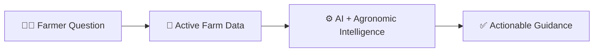
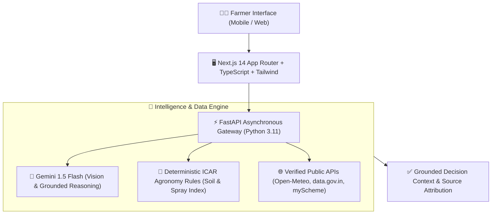

# 🌾 KisanMitra — Official HACKDAY 1.0 Pitch Presentation

> **Hackathon:** HACKDAY 1.0  
> **Theme:** *Tech for a Better Tomorrow*  
> **Tagline:** *“Smarter Decisions. Healthier Farms.”*  
> **Presentation Duration:** ~2.5 Minutes (7 Focused Slides)

---

## 🎨 Presentation Design Tokens

```text
Primary Yellow:      #F4D35E  (Harvest Gold — Brand Accent)
Agricultural Green:  #587A4C  (Crop Vitality — Section Highlights)
Background Cream:    #FAF9F4  (Organic Canvas)
Surface White:       #FFFFFF  (High-Contrast Cards)
Primary Dark Text:   #1F2933  (Clear Typography)
Secondary Text:      #667085  (Subtitles & Metadata)
Border Accent:       #E5E1D8  (Clean Dividers)
```

---

```
========================================================================================
                                      SLIDE 1 / 7
                                   PROBLEM STATEMENT
========================================================================================
```

# 🚜 Problem Statement
## *“Farmers Don't Lack Information. They Lack Connected Information.”*

```text
                      THE EVERYDAY FARMER DECISION DILEMMA
                      ------------------------------------
  
   [ 🌱 What should I grow? ]          [ 🧪 Is my soil healthy? ]
            \                                   /
             \                                 /
   [ 🌿 Is my crop sick? ]  <─── FARMER ───>  [ 🌦 What will weather do? ]
             /                                 \
            /                                   \
   [ 🏛️ What schemes exist? ]         [ 💰 Where should I sell? ]
```

### The Core Bottleneck
* **Scattered Silos:** Soil lab test cards, weather forecasts, wholesale mandi bhav, and crop disease advisories exist in isolated, disconnected channels.
* **Costly Misdiagnosis:** Unconnected symptoms lead to purchasing the wrong chemical pesticides or improper fertilizer application.
* **Delayed Decisions:** Without unified farm context, farmers face analysis paralysis and missed operational windows.

```text
    ┌──────────────────────┐     ┌─────────────────────┐     ┌──────────────────────┐
    │  Fragmented Sources  │ ──> │ Difficult Decisions │ ──> │ Delayed / Risky Action│
    └──────────────────────┘     └─────────────────────┘     └──────────────────────┘
```

> **Key Takeaway:**  
> *“The challenge isn't access to information. It's turning scattered information into one clear farming decision.”*

---
> 🎙️ **Speaker Pitch Note (25s):**  
> *"Judges, Indian agriculture doesn't suffer from a lack of data—it suffers from disconnected data. Every morning, a farmer asks: Is it going to rain? Should I spray pesticide? What is my soil deficient in? Where can I sell for the best price? Today, these answers live in six different places. Fragmented information leads to uncertain decisions and crop loss. Our mission is turning scattered data into one clear decision."*

<br/>

---

```
========================================================================================
                                      SLIDE 2 / 7
                                   PROPOSED SOLUTION
========================================================================================
```

# 💡 Proposed Solution
## **KisanMitra** — *Smarter Decisions. Healthier Farms.*
### *“One platform connecting the information behind everyday farming decisions.”*



### 🌾 The 8 Connected Intelligence Modules

```text
┌─────────────────────────────────────────────────────────────────────────────────────────┐
│                                   KISANMITRA CORE                                       │
├──────────────────────────┬──────────────────────────┬───────────────────────────────────┤
│ 🌿 AI Crop Doctor        │ 🧪 Soil Health           │ 🌦 Weather Intelligence           │
│ Gemini 1.5 Flash Vision  │ Deterministic ICAR       │ Open-Meteo hyperlocal forecasts,  │
│ instant leaf pathology.  │ benchmark scoring engine.│ spray suitability windows.        │
├──────────────────────────┼──────────────────────────┼───────────────────────────────────┤
│ 💰 Mandi Price Discovery │ 🏛️ Government Schemes    │ 🌾 Crop Agronomy Guide            │
│ Real-time APMC wholesale │ Curated subsidies, PMFBY │ ICAR crop schedules, sowing       │
│ rates (data.gov.in).     │ & official portal links. │ windows & nutrient calendars.     │
├──────────────────────────┴──────────────────────────┴───────────────────────────────────┤
│ 🤖 Context-Aware AI Farmer Assistant: Reasons over all live farm parameters.            │
│ 🌐 Native Multilingual Experience: English, Marathi, Hindi, Tamil, Telugu (100% Parity) │
└─────────────────────────────────────────────────────────────────────────────────────────┘
```

> **Key Differentiator:**  
> *“KisanMitra connects agricultural information into a single decision-support layer for farmers.”*

---
> 🎙️ **Speaker Pitch Note (25s):**  
> *"Meet KisanMitra. Rather than building another generic chatbot, we created a connected decision-support engine. KisanMitra brings together AI visual crop diagnostics, deterministic ICAR soil scoring, hyperlocal weather spray windows, official APMC mandi prices, government schemes, and crop guides. Every module shares context with our AI Farmer Assistant, available natively in 5 regional Indian languages."*

<br/>

---

```
========================================================================================
                                      SLIDE 3 / 7
                                     TARGET USERS
========================================================================================
```

# 👥 Who We Build For
## *Empowering Smallholder Farmers & the Agricultural Ecosystem*

```text
                     ┌──────────────────────────────────────────────┐
                     │               PRIMARY USER                   │
                     │          👨‍🌾 INDIVIDUAL FARMERS               │
                     │  Smallholder & marginal farmers who need     │
                     │  accessible, contextual field decisions.     │
                     └──────────────────────┬───────────────────────┘
                                            │
                     ┌──────────────────────┴───────────────────────┐
                     │        SECONDARY & FUTURE USERS              │
                     └──────────────┬───────────────────────────────┘
                                    │
           ┌────────────────────────┴────────────────────────┐
           ▼                                                 ▼
┌───────────────────────────────────┐     ┌───────────────────────────────────┐
│     🌾 FPOs & COOPERATIVES        │     │  🏛️ INSTITUTIONS & AGRITECHS      │
│ Farmer Producer Organizations     │     │ Research institutes, NGOs, and    │
│ requiring aggregated intelligence │     │ state programs delivering guided  │
│ across member clusters.           │     │ extension support.                │
└───────────────────────────────────┘     └───────────────────────────────────┘
```

### User Value Alignment
* **Primary (Farmers):** Immediate access to trusted, localized guidance in their own language without technical jargon.
* **Secondary (FPOs & Collectives):** Transparent market price comparison and shared agronomic practices across member farms.
* **Ecosystem (Institutions):** Verified pipeline for official scheme distribution and scientific agricultural advisory.

---
> 🎙️ **Speaker Pitch Note (20s):**  
> *"Our primary user is the individual smallholder farmer who needs immediate, jargon-free answers in their native tongue. Secondarily, our architecture is built to serve Farmer Producer Organizations (FPOs) and agricultural institutions who need to deliver shared agronomic intelligence across hundreds of member farms."*

<br/>

---

```
========================================================================================
                                      SLIDE 4 / 7
                                  TECHNICAL APPROACH
========================================================================================
```

# ⚙️ How KisanMitra Works
## *“AI for reasoning; deterministic science for explainability and trust.”*



### Technical Pillars
* **Hybrid Intelligence:** Computer vision & generative reasoning (Gemini) handle unstructured leaf scans and conversational queries; deterministic algorithms (ICAR rules) handle soil and spray indices.
* **Zero Client Secret Leakage:** All API keys (`GEMINI_API_KEY`, `MANDI_API_KEY`) remain strictly backend-isolated.
* **Prompt Injection Defense:** Farm context is treated strictly as reference data, preventing prompt tampering.
* **Deterministic Fallback Layer:** 100% operational offline demo resilience if external networks or quotas fail.

---
> 🎙️ **Speaker Pitch Note (25s):**  
> *"Under the hood, KisanMitra uses Next.js 14 and FastAPI with a hybrid intelligence philosophy: we use Gemini 1.5 Flash for computer vision and conversational reasoning, but we rely on deterministic ICAR agronomic models for soil scoring and spray window calculations. Zero API keys touch the frontend, and our hybrid RAG pipeline grounds every assistant response in real data."*

<br/>

---

```
========================================================================================
                                      SLIDE 5 / 7
                              MARKET & BUSINESS POTENTIAL
========================================================================================
```

# 📈 From Farmer Utility to a Scalable Platform
## *A Progressive Ecosystem Business Model*

```text
    [ STAGE 1: B2C ]              [ STAGE 2: B2B ]             [ STAGE 3: ECOSYSTEM ]
┌──────────────────────┐      ┌──────────────────────┐      ┌──────────────────────┐
│  Individual Farmers  │ ───> │  FPOs & Collectives  │ ───> │ Agritech & Enterprise │
│ Free core utility +  │      │ Group dashboards,    │      │ Institutional APIs,  │
│ advanced advisory.   │      │ price aggregation.   │      │ verification tools.  │
└──────────────────────┘      └──────────────────────┘      └──────────────────────┘
```

### Potential Future Revenue Channels
* **🌟 Premium Farmer Advisory:** High-frequency satellite monitoring and specialized crop disease tele-consultation.
* **📊 FPO & Cooperative Subscriptions:** Multi-farm management dashboards, bulk input procurement intelligence, and shared mandi trends.
* **🏢 Institutional & NGO SaaS:** Custom deployment for state agricultural extension programs and crop insurance verification workflows.
* **🔌 Data & API Intelligence Services:** Aggregated, anonymized regional agronomic indices for sustainable supply-chain partners.

---
> 🎙️ **Speaker Pitch Note (20s):**  
> *"KisanMitra begins as a high-utility free platform for individual farmers, building grassroots trust. As we scale, our business potential expands into B2B group dashboards for FPOs, institutional SaaS for agricultural NGOs and government programs, and enterprise data intelligence for sustainable agri-supply chains."*

<br/>

---

```
========================================================================================
                                      SLIDE 6 / 7
                                  SCALABILITY & FUTURE
========================================================================================
```

# 🌐 Building the Connected Farm
## *The Evolution of KisanMitra*

```text
   TODAY                           NEXT                            FUTURE
───────────────               ───────────────                 ─────────────────
• Multi-Source Decision       • Voice-First Regional AI       • Satellite NDVI Sensing
  Support Layer                 (Bhashini / Indic Voice)      • IoT Soil Probe Telemetry
• Vision Leaf Diagnostics     • Automated Farm Alerts         • Predictive Pest Outbreak
• ICAR Soil Health Engine     • Direct KVK Officer Link         Cycle Forecasting
• APMC Mandi Discovery        • FPO Collective Intelligence   • Climate-Resilient Farm
• 5 Indian Languages                                            Digital Twins
```

### Scalability Architecture
* **Stateless Asynchronous Backend:** FastAPI micro-routing scales horizontally across serverless containers.
* **Edge-Ready Frontend:** Next.js static asset caching ensures rapid load times even on 3G rural mobile networks.
* **Pluggable Vector RAG:** Ready to swap in vector embeddings (Chroma / PgVector) as knowledge base scales to thousands of district-level crop varieties.

---
> 🎙️ **Speaker Pitch Note (20s):**  
> *"Today, KisanMitra unifies 8 vital agricultural capabilities. Tomorrow, we evolve into a fully connected farm platform: adding voice-first interactions for regional dialects, IoT soil probe telemetry, satellite NDVI remote sensing, and predictive pest outbreak forecasting before diseases spread."*

<br/>

---

```
========================================================================================
                                      SLIDE 7 / 7
                                 IF WE HAD MORE TIME
========================================================================================
```

# 🚀 If We Had More Time
## *What would we build next with additional time and resources?*

```text
┌─────────────────────────────────────────────────────────────────────────────────────────┐
│ 1. 🎙️ VOICE-FIRST FARMER ASSISTANT                                                      │
│    Native voice-in / voice-out interaction in regional dialects (IndicWhisper / Bhashini│
│    to ensure complete accessibility for elderly and non-literate farmers.               │
├─────────────────────────────────────────────────────────────────────────────────────────┤
│ 2. 🛰️ SATELLITE (NDVI) + IoT TELEMETRY                                                 │
│    Live Sentinel-2 vegetation health mapping paired with on-field moisture probes.      │
├─────────────────────────────────────────────────────────────────────────────────────────┤
│ 3. 🔮 PREDICTIVE CROP RISK & PEST FORECASTING                                           │
│    Correlating weather anomalies with regional pest outbreak patterns 7 days in advance.│
├─────────────────────────────────────────────────────────────────────────────────────────┤
│ 4. 👨‍🔬 1-CLICK KVK & EXPERT TELE-AGRONOMIST CONNECT                                      │
│    Live video/audio consultation escalation to certified Krishi Vigyan Kendra scientists│
├─────────────────────────────────────────────────────────────────────────────────────────┤
│ 5. 🤝 FPO COLLECTIVE MARKET BARGAINING HUB                                              │
│    Enabling farm collectives to pool harvest volumes and negotiate directly with buyers.│
└─────────────────────────────────────────────────────────────────────────────────────────┘
```

---

### 🌟 Final Closing Statement

> ### **“KisanMitra is not just an AI farming app.**  
> ### **It is a connected decision layer for agriculture.”**

---
> 🎙️ **Speaker Pitch Note (20s):**  
> *"If we had more time, our top priority is voice-first Indic AI so any farmer can simply speak to their phone in their local dialect, followed by satellite NDVI sensing and direct KVK scientist escalation. KisanMitra is not just another farming app—it is the connected decision layer Indian agriculture needs. Thank you!"*
