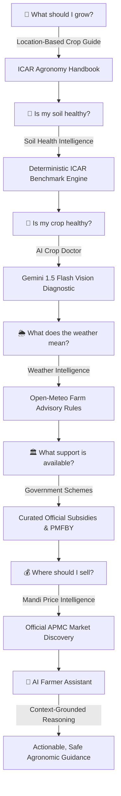

# 💡 The Solution: KisanMitra

## Smarter Decisions. Healthier Farms.

**KisanMitra** is an AI-powered agricultural decision-support platform that unifies scattered agricultural information into one connected, intuitive, and accessible interface.

Instead of making generic AI chatbots the hero, KisanMitra places the **FARMER'S DECISION** at the center:

$$\text{FARMER DECISION} \longrightarrow \text{RELEVANT DATA} \longrightarrow \text{INTELLIGENCE} \longrightarrow \text{ACTIONABLE GUIDANCE}$$

---

## 🌾 The Connected Decision Chain

KisanMitra links every stage of the farming lifecycle into a cohesive intelligence loop:

---

## 🌟 Key Value Pillars

1. **One Unified Platform:** Replaces 6+ disjointed tools with a single, responsive dashboard.
2. **Deterministic Science First:** Soil recommendations and weather spray indices rely on verified agronomic rules (ICAR benchmarks) rather than generative guesswork.
3. **Transparent Data Provenance:** Zero fabricated prices; every APMC rate, weather forecast, and government scheme links to official sources (data.gov.in, Open-Meteo, myScheme).
4. **Context-Aware Conversational AI:** The AI Farmer Assistant knows your active crop, soil test, leaf diagnosis, local weather, and nearby mandi rates before formulating advice.
5. **Universal Regional Accessibility:** Complete native experience in English, Marathi, Hindi, Tamil, and Telugu with 100% key parity.
